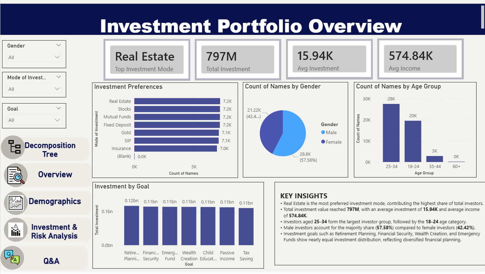
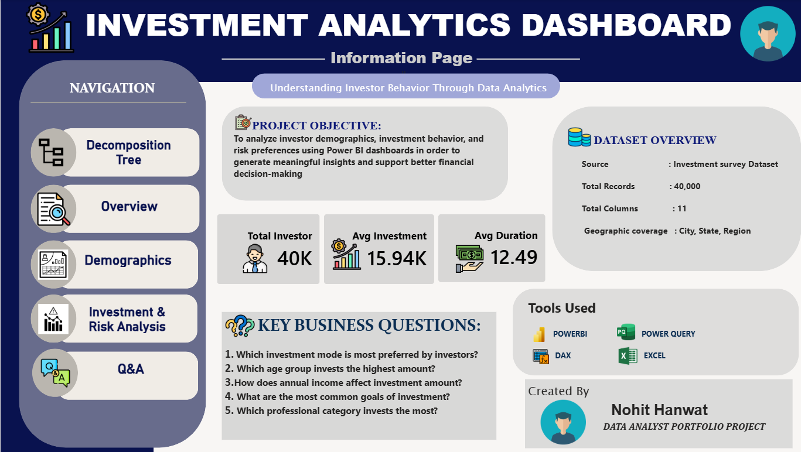
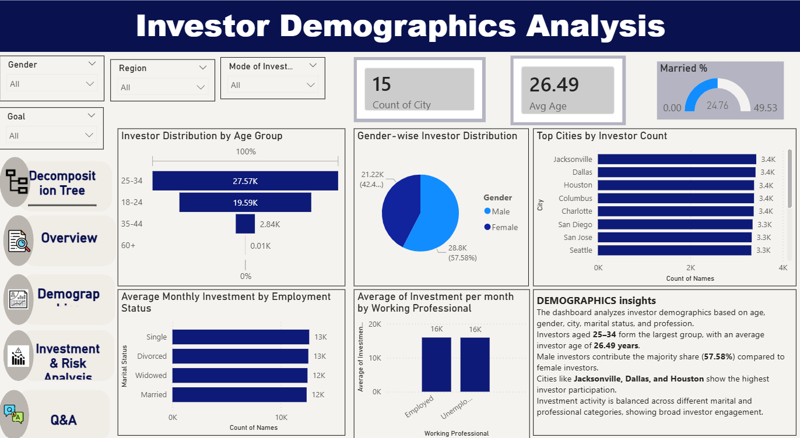

# Investment Survey Overview | Power BI

## Project Overview

An interactive Power BI dashboard created to analyze investment preferences, investor demographics, and risk preferences.

## Tools Used

- Power BI
- Excel
- Power Query
- DAX

## Key KPIs

- Total Respondents
- Average Age
- Top Investment Type
- High Risk %

## Dashboard Features

- Investment preference analysis
- Demographic analysis
- Risk preference analysis
- Interactive slicers and filters
- KPI cards and charts
- Data-driven insights

## Dashboard Preview

### Overview

### Introduction

### Demographics

### Decomposition Tree

## Project Files

- `Investment_Survey_Overview.pbix` – Power BI dashboard
- Dashboard screenshots for project preview

## Skills Demonstrated

Power BI | Excel | Power Query | DAX | Data Cleaning | Data Visualization | Dashboard Development
